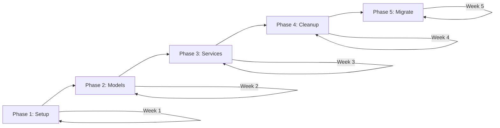

# SQLAlchemy to Flask-SQLAlchemy Migration Plan

> **Project:** svg_translate_web  
> **Date:** May 2026  
> **Target:** Migrate from plain SQLAlchemy to Flask-SQLAlchemy  
> **Database:** MySQL (PyMySQL driver)  
> **Risk Level:** Medium — existing app factory pattern reduces risk significantly

---

## Table of Contents

1. [Current Architecture Assessment](#1-current-architecture-assessment)
2. [Migration Strategy](#2-migration-strategy)
3. [Project Structure Refactor](#3-project-structure-refactor)
4. [Flask-SQLAlchemy Setup](#4-flask-sqlalchemy-setup)
5. [Model Migration](#5-model-migration)
6. [Session & Transaction Management](#6-session--transaction-management)
7. [Alembic / Flask-Migrate Integration](#7-alembic--flask-migrate-integration)
8. [Application Factory Pattern](#8-application-factory-pattern)
9. [Testing Migration](#9-testing-migration)
10. [Performance & Scalability](#10-performance--scalability)
11. [Common Pitfalls](#11-common-pitfalls)
12. [Step-by-Step Execution Timeline](#12-step-by-step-execution-timeline)
13. [Code Examples](#13-code-examples)
14. [Final Deliverables](#14-final-deliverables)

---


## 1. Current Architecture Assessment

### 1.1 Current Project Structure

```
src/main_app/
├── __init__.py                    # App factory (create_app)
├── config.py                      # Settings with DbConfig dataclass
├── sqlalchemy_db/
│   ├── engine.py                  # BaseDb, build_engine, init_db, get_session
│   ├── models/
│   │   ├── __init__.py            # Re-exports all models
│   │   ├── jobs.py                # JobRecord
│   │   ├── owid_charts.py         # OwidChartRecord
│   │   ├── settings.py            # SettingRecord
│   │   ├── templates.py           # TemplateRecord
│   │   ├── users.py               # AdminUserRecord, UserTokenRecord
│   │   └── views.py               # TemplateNeedUpdateRecord, OwidChartTemplateRecord
│   └── services/
│       ├── __init__.py
│       ├── admin_service.py
│       ├── jobs_service.py
│       ├── owid_charts_service.py
│       ├── settings_service.py
│       ├── template_need_update_service.py
│       ├── template_service.py
│       └── user_token_service.py
└── app_routes/                    # Flask Blueprints
```

### 1.2 Current Patterns in Use

| Pattern | Implementation | Notes |
|---------|---------------|-------|
| Declarative Base | `BaseDb(DeclarativeBase)` | Custom base with `to_dict()` helper |
| Engine Creation | `build_engine(db_url)` | pool_pre_ping, pool_size=5, max_overflow=10 |
| Session Factory | Module-level `_SessionFactory` singleton | `sessionmaker(bind=engine, expire_on_commit=False)` |
| Session Access | `get_session()` function | Used as context manager: `with get_session() as session:` |
| DB Init | `init_db(db_url, create_tables=False)` | Called once in `create_app()` |
| Models | Classic `Column()` style | No `Mapped[]` type annotations |
| Views | `info={"is_view": True}` metadata | Auto-created via SQLAlchemy event listener |
| Relationships | One `viewonly` relationship | `OwidChartRecord._template_info` |
| Services | Function-based, each creates own session | No request-scoped session |

### 1.3 Anti-Patterns Identified

1. **No request-scoped session management** — Each service function creates and destroys its own session, meaning multiple DB operations in a single request use separate sessions/transactions.
2. **No migration tool** — No Alembic/Flask-Migrate. Schema changes require manual SQL.
3. **Module-level mutable state** — `_SessionFactory` global can cause issues in testing and multi-app scenarios.
4. **No session cleanup on request teardown** — If a session leaks, no automatic cleanup exists.

### 1.4 Migration Risk Analysis

```
┌─────────────────────────────┬────────┬─────────────────────────────────────┐
│ Risk                        │ Level  │ Mitigation                          │
├─────────────────────────────┼────────┼─────────────────────────────────────┤
│ Session behavior changes    │ Medium │ Test all service functions           │
│ View auto-creation breaks   │ Medium │ Custom event listener preservation  │
│ Import circular deps        │ Low    │ Already uses app factory            │
│ Connection pool changes     │ Low    │ Configure Flask-SQLAlchemy pool     │
│ Existing data corruption    │ None   │ No schema changes required          │
│ Downtime during migration   │ Low    │ Incremental approach                │
└─────────────────────────────┴────────┴─────────────────────────────────────┘
```

---


## 2. Migration Strategy

### 2.1 Incremental vs Full Migration

| Approach | Pros | Cons | Recommendation |
|----------|------|------|----------------|
| **Full (Big Bang)** | Clean codebase, no dual-mode code | High risk, long freeze | ❌ Not recommended |
| **Incremental (Phased)** | Low risk, rollback possible, testable | Temporary dual code | ✅ Recommended |

### 2.2 Recommended Phased Rollout



**Phase 1 — Infrastructure Setup (Week 1)**
- Install Flask-SQLAlchemy and Flask-Migrate
- Create `extensions.py` with `db = SQLAlchemy()` instance
- Update `create_app()` to initialize `db`
- Keep old `engine.py` functional (backward compatibility)

**Phase 2 — Model Migration (Week 2)**
- Migrate models from `BaseDb` to `db.Model`
- Preserve `to_dict()` mixin
- Handle views with custom metadata
- Validate all relationships still work

**Phase 3 — Service Layer Migration (Week 3)**
- Replace `get_session()` calls with `db.session`
- Remove explicit session creation/closure
- Add proper transaction boundaries
- Test each service independently

**Phase 4 — Cleanup (Week 4)**
- Remove `engine.py` singleton pattern
- Remove `_SessionFactory` global
- Update all imports
- Add Flask-Migrate for schema management

**Phase 5 — Production Validation (Week 5)**
- Run full integration tests
- Deploy to staging
- Monitor connection pool and session behavior
- Cut over to production

### 2.3 Backward Compatibility

During the transition, maintain a compatibility layer:

```python
# compat.py — Temporary bridge during migration
from flask import current_app, has_app_context
from .extensions import db

def get_session():
    """Backward-compatible session getter.
    Uses Flask-SQLAlchemy session when in app context,
    falls back to old behavior otherwise (e.g., scripts).
    """
    if has_app_context():
        return db.session
    # Fallback for CLI scripts or workers not in Flask context
    from .sqlalchemy_db.engine import get_session as legacy_get_session
    return legacy_get_session()
```

### 2.4 Refactoring Priorities

1. **Extensions setup** (blocks everything else)
2. **Base model migration** (blocks service migration)
3. **Service layer** (highest code impact)
4. **Route integration** (should "just work" after services migrate)
5. **Testing infrastructure** (validates correctness)
6. **Flask-Migrate setup** (future-proofing)

---


## 3. Project Structure Refactor

### 3.1 Target Directory Structure

```
src/main_app/
├── __init__.py                    # App factory (create_app)
├── extensions.py                  # NEW: db = SQLAlchemy(), migrate = Migrate()
├── config.py                      # Updated: SQLALCHEMY_DATABASE_URI added
├── models/                        # MOVED from sqlalchemy_db/models/
│   ├── __init__.py                # Re-exports all models
│   ├── base.py                    # NEW: Mixins (ToDictMixin, TimestampMixin)
│   ├── jobs.py                    # JobRecord(db.Model)
│   ├── owid_charts.py             # OwidChartRecord(db.Model)
│   ├── settings.py                # SettingRecord(db.Model)
│   ├── templates.py               # TemplateRecord(db.Model)
│   ├── users.py                   # AdminUserRecord, UserTokenRecord
│   └── views.py                   # View models with custom metadata
├── services/                      # MOVED from sqlalchemy_db/services/
│   ├── __init__.py
│   ├── admin_service.py           # Uses db.session
│   ├── jobs_service.py
│   ├── owid_charts_service.py
│   ├── settings_service.py
│   ├── template_need_update_service.py
│   ├── template_service.py
│   └── user_token_service.py
├── app_routes/                    # Unchanged — Blueprints
├── migrations/                    # NEW: Flask-Migrate / Alembic
│   ├── alembic.ini
│   ├── env.py
│   └── versions/
└── sqlalchemy_db/                 # DEPRECATED — remove in Phase 4
    └── engine.py                  # Kept temporarily for compat
```

### 3.2 Blueprint Integration

Blueprints remain unchanged. The key integration point is that services now use `db.session` which is automatically scoped to the request lifecycle by Flask-SQLAlchemy.

```python
# app_routes/admin_routes/jobs.py — No changes needed if services handle DB
from ...services.jobs_service import create_job, get_job

@bp.route('/jobs', methods=['POST'])
def start_job():
    job = create_job(job_type="fix_nested", username=g.user)
    return jsonify(job.to_dict())
```

### 3.3 Extensions Pattern

```python
# src/main_app/extensions.py
from flask_sqlalchemy import SQLAlchemy
from flask_migrate import Migrate

db = SQLAlchemy()
migrate = Migrate()
```

This file must have **zero** application imports to prevent circular dependencies.

---


## 4. Flask-SQLAlchemy Setup

### 4.1 Installation

```bash
pip install Flask-SQLAlchemy>=3.1
pip install Flask-Migrate>=4.0
pip install alembic>=1.13
```

Add to `requirements.txt`:
```
Flask-SQLAlchemy>=3.1.0
Flask-Migrate>=4.0.0
```

### 4.2 Configuration

```python
# src/main_app/config.py — Add to existing settings

@dataclass(frozen=True)
class FlaskSQLAlchemyConfig:
    """Flask-SQLAlchemy configuration mapped from existing DbConfig."""
    
    SQLALCHEMY_DATABASE_URI: str
    SQLALCHEMY_TRACK_MODIFICATIONS: bool = False
    SQLALCHEMY_ENGINE_OPTIONS: dict = None
    
    def __post_init__(self):
        if self.SQLALCHEMY_ENGINE_OPTIONS is None:
            object.__setattr__(self, 'SQLALCHEMY_ENGINE_OPTIONS', {
                'pool_pre_ping': True,
                'pool_size': 5,
                'max_overflow': 10,
                'pool_recycle': 3600,
                'connect_args': {
                    'connect_timeout': 5,
                    'init_command': 'SET time_zone = "+00:00"',
                    'charset': 'utf8mb4',
                },
            })
```

### 4.3 Environment-Specific Configuration

```python
# config.py additions

def build_sqlalchemy_uri(db_config: DbConfig) -> str:
    """Build SQLAlchemy URI from existing DbConfig dataclass."""
    return (
        f"mysql+pymysql://{db_config.db_user}:{db_config.db_password}"
        f"@{db_config.db_host}/{db_config.db_name}"
    )

class DevelopmentConfig:
    SQLALCHEMY_DATABASE_URI = build_sqlalchemy_uri(settings.database_data)
    SQLALCHEMY_TRACK_MODIFICATIONS = False
    SQLALCHEMY_ECHO = True  # Log SQL in development
    SQLALCHEMY_ENGINE_OPTIONS = {
        'pool_pre_ping': True,
        'pool_size': 5,
        'max_overflow': 10,
        'pool_recycle': 3600,
        'connect_args': {
            'connect_timeout': 5,
            'init_command': 'SET time_zone = "+00:00"',
            'charset': 'utf8mb4',
        },
    }

class ProductionConfig:
    SQLALCHEMY_DATABASE_URI = build_sqlalchemy_uri(settings.database_data)
    SQLALCHEMY_TRACK_MODIFICATIONS = False
    SQLALCHEMY_ECHO = False
    SQLALCHEMY_ENGINE_OPTIONS = {
        'pool_pre_ping': True,
        'pool_size': 10,
        'max_overflow': 20,
        'pool_recycle': 1800,
        'connect_args': {
            'connect_timeout': 5,
            'init_command': 'SET time_zone = "+00:00"',
            'charset': 'utf8mb4',
        },
    }

class TestingConfig:
    SQLALCHEMY_DATABASE_URI = "sqlite:///:memory:"
    SQLALCHEMY_TRACK_MODIFICATIONS = False
    SQLALCHEMY_ECHO = False
    TESTING = True
```

### 4.4 Database URI Handling

The existing `build_db_url()` function in `engine.py` already produces valid SQLAlchemy URIs. Reuse this logic:

```python
# In create_app or config
if settings.database_data.db_host:
    app.config['SQLALCHEMY_DATABASE_URI'] = build_db_url(settings.database_data.to_dict())
```

### 4.5 Session Management Differences

| Aspect | Current (Plain SQLAlchemy) | Flask-SQLAlchemy |
|--------|---------------------------|-----------------|
| Session creation | Manual via `get_session()` | Automatic via `db.session` |
| Session scope | Per-function (no sharing) | Per-request (shared across functions) |
| Cleanup | Manual `session.close()` | Automatic at request teardown |
| Transaction | Explicit `session.commit()` | Explicit `db.session.commit()` |
| Rollback | Manual in except blocks | Automatic on unhandled exceptions |

---


## 5. Model Migration

### 5.1 Converting Existing Models

The key change: models inherit from `db.Model` instead of `BaseDb(DeclarativeBase)`.

Flask-SQLAlchemy 3.x uses its own `DeclarativeBase` under the hood, so the transition is straightforward.

### 5.2 Base Mixin Preservation

Create a mixin to preserve the existing `to_dict()` functionality:

```python
# src/main_app/models/base.py
from __future__ import annotations
from typing import Any
from datetime import datetime

class ToDictMixin:
    """Preserves the existing to_dict behavior from BaseDb."""
    
    def to_dict(self) -> dict[str, Any]:
        data = {
            column.name: getattr(self, column.name)
            for column in self.__table__.columns
        }
        # Handle date serialization
        for key, value in data.items():
            if isinstance(value, datetime):
                data[key] = value.isoformat()
        return data


class TimestampMixin:
    """Common timestamp columns used across most models."""
    from sqlalchemy import Column, DateTime, func
    
    created_at = Column(DateTime, nullable=False, server_default=func.current_timestamp())
    updated_at = Column(
        DateTime,
        nullable=False,
        server_default=func.current_timestamp(),
        server_onupdate=func.current_timestamp(),
    )
```

### 5.3 Model Conversion Example — Before/After

**BEFORE (current — `engine.py` base):**

```python
# src/main_app/sqlalchemy_db/models/jobs.py
from sqlalchemy import Column, DateTime, Integer, String, func
from ..engine import BaseDb

class JobRecord(BaseDb):
    __tablename__ = "jobs"
    
    id = Column(Integer, primary_key=True, autoincrement=True)
    job_type = Column(String(255), nullable=False)
    username = Column(String(255), nullable=True)
    status = Column(String(50), nullable=False, server_default="pending")
    started_at = Column(DateTime, nullable=True)
    completed_at = Column(DateTime, nullable=True)
    result_file = Column(String(500), nullable=True)
    created_at = Column(DateTime, nullable=False, server_default=func.current_timestamp())
    updated_at = Column(DateTime, nullable=False, server_default=func.current_timestamp(),
                        server_onupdate=func.current_timestamp())
```

**AFTER (Flask-SQLAlchemy):**

```python
# src/main_app/models/jobs.py
from sqlalchemy import Column, DateTime, Integer, String, func
from ..extensions import db
from .base import ToDictMixin, TimestampMixin

class JobRecord(ToDictMixin, TimestampMixin, db.Model):
    __tablename__ = "jobs"
    
    id = Column(Integer, primary_key=True, autoincrement=True)
    job_type = Column(String(255), nullable=False)
    username = Column(String(255), nullable=True)
    status = Column(String(50), nullable=False, server_default="pending")
    started_at = Column(DateTime, nullable=True)
    completed_at = Column(DateTime, nullable=True)
    result_file = Column(String(500), nullable=True)
```

### 5.4 Relationship Handling

The existing `viewonly` relationship in `OwidChartRecord` migrates directly:

```python
# src/main_app/models/owid_charts.py
from ..extensions import db
from .base import ToDictMixin

class OwidChartRecord(ToDictMixin, db.Model):
    __tablename__ = "owid_charts"
    
    chart_id = Column(Integer, primary_key=True, autoincrement=True)
    # ... columns ...
    
    _template_info = db.relationship(
        "OwidChartTemplateRecord",
        primaryjoin="OwidChartRecord.chart_id == OwidChartTemplateRecord.chart_id",
        foreign_keys="OwidChartTemplateRecord.chart_id",
        viewonly=True,
        uselist=False,
    )
```

### 5.5 View Model Migration

SQL Views require special handling. Flask-SQLAlchemy will try to create tables for all models. Use `__table_args__` with the existing `is_view` pattern:

```python
# src/main_app/models/views.py
from ..extensions import db
from .base import ToDictMixin

class TemplateNeedUpdateRecord(ToDictMixin, db.Model):
    __tablename__ = "templates_need_update"
    
    template_id = Column(Integer, primary_key=True)
    template_title = Column(String(255), unique=True, nullable=False)
    slug = Column(String(255), nullable=False, server_default="")
    last_world_year = Column(Integer, nullable=True)
    max_time = Column(Integer, nullable=True)
    
    __table_args__ = (
        {"info": {
            "is_view": True,
            "create_query": """
                CREATE VIEW templates_need_update AS
                SELECT t.id AS template_id, t.title AS template_title,
                       t.slug AS slug, t.last_world_year, c.max_time
                FROM owid_charts c
                JOIN templates t ON t.slug = c.slug
                WHERE t.last_world_year <> c.max_time
                  AND t.last_world_year IS NOT NULL;
            """,
        }},
    )
```

Register the view creation event on `db.metadata` after `db.init_app(app)`:

```python
# In create_app or extensions setup
from sqlalchemy import event, inspect, text

@event.listens_for(db.metadata, "after_create")
def create_views(target, connection, **kw):
    inspector = inspect(connection)
    existing_views = inspector.get_view_names()
    for table in target.tables.values():
        if table.info.get("is_view") and table.name not in existing_views:
            create_query = table.info.get("create_query")
            if create_query:
                connection.execute(text(create_query))
```

### 5.6 Naming Conventions

Maintain existing table names. Flask-SQLAlchemy does NOT auto-generate table names if `__tablename__` is explicitly set (which all current models do).

### 5.7 Custom Type (LONGTEXT)

The existing `LONGTEXT` TypeDecorator migrates unchanged — it's pure SQLAlchemy and works with Flask-SQLAlchemy:

```python
# src/main_app/models/types.py (move from engine.py)
from sqlalchemy import Text
from sqlalchemy.dialects.mysql import LONGTEXT as LONGTEXTSQLALCHEMY
from sqlalchemy.types import TypeDecorator

class LONGTEXT(TypeDecorator):
    impl = Text
    cache_ok = True

    def load_dialect_impl(self, dialect):
        if dialect.name == "mysql":
            return dialect.type_descriptor(LONGTEXTSQLALCHEMY())
        return dialect.type_descriptor(Text())
```

---


## 6. Session & Transaction Management

### 6.1 Key Differences

```
┌──────────────────────────────────────────────────────────────────────┐
│                    CURRENT: Plain SQLAlchemy                          │
├──────────────────────────────────────────────────────────────────────┤
│  Request → Service func → get_session() → work → commit → close     │
│  Request → Service func → get_session() → work → commit → close     │
│  (Each function = separate session = separate transaction)           │
└──────────────────────────────────────────────────────────────────────┘

┌──────────────────────────────────────────────────────────────────────┐
│                    TARGET: Flask-SQLAlchemy                           │
├──────────────────────────────────────────────────────────────────────┤
│  Request → db.session (shared) → service1 → service2 → commit       │
│  Teardown → session.remove() (automatic)                             │
│  (All functions in a request share one session/transaction)          │
└──────────────────────────────────────────────────────────────────────┘
```

### 6.2 Scoped Sessions

Flask-SQLAlchemy uses `scoped_session` bound to the application context. This means:

- `db.session` is always the same session within a single request
- The session is automatically removed at the end of the request
- No need to pass sessions between functions

### 6.3 Request Lifecycle Integration

```python
# Flask-SQLAlchemy handles this automatically, but here's the mental model:

# 1. Request arrives
# 2. First access to db.session creates a new scoped session
# 3. All service calls use the same session
# 4. On successful response: session state preserved (you must commit explicitly)
# 5. On exception: session is rolled back automatically
# 6. After response: session.remove() called by teardown handler
```

### 6.4 Transaction Best Practices

```python
# PATTERN 1: Service commits its own transaction (simple operations)
def create_job(job_type: str, username: str | None = None) -> JobRecord:
    job = JobRecord(job_type=job_type, username=username, status="pending")
    db.session.add(job)
    db.session.commit()
    return job

# PATTERN 2: Caller controls transaction (complex multi-step operations)
def create_job_no_commit(job_type: str, username: str | None = None) -> JobRecord:
    job = JobRecord(job_type=job_type, username=username, status="pending")
    db.session.add(job)
    db.session.flush()  # Gets the ID without committing
    return job

# In the route:
@bp.route('/complex-operation', methods=['POST'])
def complex_operation():
    try:
        job = create_job_no_commit("batch", g.user)
        update_related_records(job.id)
        db.session.commit()
    except Exception:
        db.session.rollback()
        raise
```

### 6.5 Error Handling Patterns

```python
# Recommended pattern for service functions
from ..extensions import db
from sqlalchemy.exc import IntegrityError

def create_template(title: str, slug: str) -> TemplateRecord:
    """Create a template with proper error handling."""
    try:
        template = TemplateRecord(title=title, slug=slug)
        db.session.add(template)
        db.session.commit()
        return template
    except IntegrityError:
        db.session.rollback()
        raise ValueError(f"Template with title '{title}' already exists")
    except Exception:
        db.session.rollback()
        raise
```

### 6.6 Migration of `with get_session() as session:` Pattern

**Before:**
```python
def get_all_templates():
    with get_session() as session:
        rows = session.query(TemplateRecord).all()
        return [r.to_dict() for r in rows]
```

**After:**
```python
def get_all_templates():
    rows = db.session.query(TemplateRecord).all()
    return [r.to_dict() for r in rows]
```

> **Important:** With Flask-SQLAlchemy, you do NOT wrap `db.session` in a `with` block. The session lifecycle is managed by Flask.

---


## 7. Alembic / Flask-Migrate Integration

### 7.1 Setup

```bash
# Initialize Flask-Migrate (creates migrations/ directory)
flask db init
```

```python
# In extensions.py
from flask_migrate import Migrate
migrate = Migrate()

# In create_app()
from .extensions import db, migrate
db.init_app(app)
migrate.init_app(app, db)
```

### 7.2 Existing Database Compatibility

Since the database already exists with tables, stamp the current state:

```bash
# After running `flask db init`, stamp current DB state
flask db stamp head
```

This tells Alembic "the database is already at the latest known state" without running any migrations.

### 7.3 Generating Migrations Safely

```bash
# Generate a migration after model changes
flask db migrate -m "describe the change"

# ALWAYS review the generated migration before applying
# Check migrations/versions/<hash>_describe_the_change.py

# Apply the migration
flask db upgrade
```

**Critical:** Always set `compare_type=True` in `env.py` to detect column type changes:

```python
# migrations/env.py
def run_migrations_online():
    # ...
    context.configure(
        connection=connection,
        target_metadata=target_metadata,
        compare_type=True,        # Detect type changes
        compare_server_default=True,  # Detect default changes
    )
```

### 7.4 Handling Views in Migrations

Views must be excluded from autogeneration. Add to `env.py`:

```python
# migrations/env.py
def include_object(object, name, type_, reflected, compare_to):
    """Exclude views from migration autogeneration."""
    if type_ == "table":
        # Check if this table is actually a view
        if hasattr(object, 'info') and object.info.get("is_view"):
            return False
    return True

# In run_migrations_online():
context.configure(
    # ...
    include_object=include_object,
)
```

### 7.5 Rollback Strategy

```bash
# Rollback one migration
flask db downgrade -1

# Rollback to specific revision
flask db downgrade <revision_hash>

# Show current revision
flask db current

# Show migration history
flask db history
```

### 7.6 Production Migration Workflow

```
┌─────────────────────────────────────────────────────────────┐
│ Production Migration Workflow                                 │
├─────────────────────────────────────────────────────────────┤
│ 1. Generate migration in development                         │
│ 2. Review generated migration SQL                            │
│ 3. Test upgrade + downgrade locally                          │
│ 4. Test on staging environment                               │
│ 5. Create database backup                                    │
│ 6. Apply migration in production (during low traffic)        │
│ 7. Verify application health                                 │
│ 8. If issues → flask db downgrade + restore backup           │
└─────────────────────────────────────────────────────────────┘
```

---


## 8. Application Factory Pattern

### 8.1 Updated `create_app` Implementation

```python
# src/main_app/__init__.py
"""Flask application factory."""
from __future__ import annotations

import logging
from typing import Any

from flask import Flask, flash, render_template
from flask_wtf.csrf import CSRFError, CSRFProtect

from .config import settings, build_sqlalchemy_uri
from .extensions import db, migrate

logger = logging.getLogger(__name__)


def create_app(config_override: dict | None = None) -> Flask:
    """Create and configure the Flask application."""
    
    app = Flask(
        __name__,
        template_folder="../templates",
        static_folder="../static",
    )
    app.url_map.strict_slashes = False
    app.secret_key = settings.secret_key
    
    # --- Database Configuration ---
    if settings.database_data.db_host or settings.database_data.db_user:
        app.config['SQLALCHEMY_DATABASE_URI'] = build_sqlalchemy_uri(settings.database_data)
    else:
        app.config['SQLALCHEMY_DATABASE_URI'] = "sqlite:///:memory:"
    
    app.config['SQLALCHEMY_TRACK_MODIFICATIONS'] = False
    app.config['SQLALCHEMY_ENGINE_OPTIONS'] = {
        'pool_pre_ping': True,
        'pool_size': 5,
        'max_overflow': 10,
        'pool_recycle': 3600,
        'connect_args': {
            'connect_timeout': 5,
            'init_command': 'SET time_zone = "+00:00"',
            'charset': 'utf8mb4',
        },
    }
    
    # Apply any test/override configuration
    if config_override:
        app.config.update(config_override)
    
    # --- Initialize Extensions ---
    db.init_app(app)
    migrate.init_app(app, db)
    
    # CSRF Protection
    CSRFProtect(app)
    app.config["WTF_CSRF_TIME_LIMIT"] = settings.csrf_time_limit
    
    # --- Register Views Event Listener ---
    _register_view_creation_listener()
    
    # --- Register Blueprints ---
    _register_blueprints(app)
    
    # --- Register Error Handlers ---
    _register_error_handlers(app)
    
    # --- Context Processors ---
    _register_context_processors(app)
    
    return app


def _register_view_creation_listener():
    """Register SQLAlchemy event to auto-create SQL views."""
    from sqlalchemy import event, inspect, text
    
    @event.listens_for(db.metadata, "after_create")
    def create_views(target, connection, **kw):
        inspector = inspect(connection)
        existing_views = inspector.get_view_names()
        for table in target.tables.values():
            if table.info.get("is_view") and table.name not in existing_views:
                create_query = table.info.get("create_query")
                if create_query:
                    connection.execute(text(create_query))


def _register_blueprints(app: Flask) -> None:
    from .app_routes import (
        bp_admin, bp_api, bp_auth, bp_explorer,
        bp_extract, bp_jobs, bp_main, bp_owid_charts,
    )
    app.register_blueprint(bp_main)
    app.register_blueprint(bp_explorer)
    app.register_blueprint(bp_jobs)
    app.register_blueprint(bp_admin)
    app.register_blueprint(bp_auth)
    app.register_blueprint(bp_extract)
    app.register_blueprint(bp_owid_charts)
    app.register_blueprint(bp_api)


def _register_error_handlers(app: Flask) -> None:
    # ... existing error handlers unchanged ...
    pass


def _register_context_processors(app: Flask) -> None:
    from .su_services.users_service import context_user
    from .utils import format_stage_timestamp, short_url
    
    @app.context_processor
    def inject_user():
        return context_user()
    
    app.jinja_env.filters['stage_timestamp'] = format_stage_timestamp
    app.jinja_env.filters['short_url'] = short_url
```

### 8.2 Extension Initialization Order

```
1. Create Flask app
2. Configure app.config (DB URI, engine options)
3. db.init_app(app)          ← Binds SQLAlchemy to app
4. migrate.init_app(app, db) ← Binds Alembic to app+db
5. CSRFProtect(app)          ← CSRF (no DB dependency)
6. Register blueprints       ← Routes (may import models)
7. Register error handlers   ← Error pages
```

### 8.3 Circular Import Prevention

**Rule:** `extensions.py` must NEVER import from other application modules.

```
extensions.py  ← ZERO app imports (only Flask-SQLAlchemy, Flask-Migrate)
     ↓
models/*.py    ← Import from extensions.py only
     ↓
services/*.py  ← Import from extensions.py + models
     ↓
routes/*.py    ← Import from services + models
     ↓
__init__.py    ← Imports everything (but inside functions, not at module level)
```

### 8.4 Testing `create_app`

```python
def test_create_app_with_sqlite():
    app = create_app(config_override={
        'SQLALCHEMY_DATABASE_URI': 'sqlite:///:memory:',
        'TESTING': True,
    })
    assert app.config['TESTING'] is True
    with app.app_context():
        db.create_all()
```

---


## 9. Testing Migration

### 9.1 Refactoring Unit Tests

**Current test pattern (likely):**
```python
# Tests probably call init_db() directly with a test database
def setup():
    init_db("sqlite:///:memory:", create_tables=True)
```

**New test pattern:**
```python
import pytest
from src.main_app import create_app
from src.main_app.extensions import db

@pytest.fixture
def app():
    """Create application for testing."""
    app = create_app(config_override={
        'SQLALCHEMY_DATABASE_URI': 'sqlite:///:memory:',
        'TESTING': True,
        'WTF_CSRF_ENABLED': False,
    })
    
    with app.app_context():
        # Create only real tables (exclude views for SQLite)
        real_tables = [
            t for t in db.metadata.tables.values()
            if not t.info.get("is_view")
        ]
        db.metadata.create_all(db.engine, tables=real_tables)
        yield app
        db.session.remove()
        db.drop_all()

@pytest.fixture
def client(app):
    """Test client."""
    return app.test_client()

@pytest.fixture
def db_session(app):
    """Database session for direct DB testing."""
    with app.app_context():
        yield db.session
        db.session.rollback()
```

### 9.2 Database Fixtures

```python
@pytest.fixture
def sample_job(db_session):
    """Create a sample job for testing."""
    from src.main_app.models import JobRecord
    job = JobRecord(job_type="test_job", username="testuser", status="pending")
    db_session.add(job)
    db_session.commit()
    return job

@pytest.fixture
def sample_template(db_session):
    """Create a sample template for testing."""
    from src.main_app.models import TemplateRecord
    template = TemplateRecord(title="Test Template", slug="test-slug", source="")
    db_session.add(template)
    db_session.commit()
    return template
```

### 9.3 Test Transactions (Rollback after each test)

```python
@pytest.fixture(autouse=True)
def auto_rollback(app):
    """Automatically rollback DB changes after each test."""
    with app.app_context():
        db.session.begin_nested()  # SAVEPOINT
        yield
        db.session.rollback()      # Rollback to savepoint
        db.session.remove()
```

### 9.4 Mocking Strategies

```python
# Mock external API calls, not the database layer
from unittest.mock import patch

def test_create_job_service(db_session):
    """Test service function directly with real DB session."""
    from src.main_app.services.jobs_service import create_job
    
    job = create_job(job_type="test", username="user1")
    assert job.id is not None
    assert job.status == "pending"

# For integration tests that need to mock DB:
def test_route_with_db_error(client, mocker):
    """Test error handling when DB fails."""
    mocker.patch(
        'src.main_app.services.jobs_service.db.session.commit',
        side_effect=Exception("DB Error")
    )
    response = client.post('/jobs')
    assert response.status_code == 500
```

### 9.5 CI/CD Updates

Update `.github/workflows/pytest.yaml`:

```yaml
env:
  SQLALCHEMY_DATABASE_URI: "sqlite:///:memory:"
  FLASK_ENV: testing

steps:
  - name: Run tests
    run: |
      pip install -r requirements-dev.txt
      pytest --tb=short -q
```

### 9.6 conftest.py Template

```python
# tests/conftest.py
import pytest
from src.main_app import create_app
from src.main_app.extensions import db as _db

@pytest.fixture(scope='session')
def app():
    """Session-scoped test application."""
    app = create_app(config_override={
        'SQLALCHEMY_DATABASE_URI': 'sqlite:///:memory:',
        'TESTING': True,
        'WTF_CSRF_ENABLED': False,
    })
    return app

@pytest.fixture(scope='session')
def database(app):
    """Create all tables once per test session."""
    with app.app_context():
        real_tables = [
            t for t in _db.metadata.tables.values()
            if not t.info.get("is_view")
        ]
        _db.metadata.create_all(_db.engine, tables=real_tables)
        yield _db
        _db.drop_all()

@pytest.fixture(autouse=True)
def session(app, database):
    """Each test runs in a transaction that gets rolled back."""
    with app.app_context():
        connection = database.engine.connect()
        transaction = connection.begin()
        
        database.session.configure(bind=connection)
        
        yield database.session
        
        transaction.rollback()
        connection.close()
        database.session.remove()
```

---


## 10. Performance & Scalability

### 10.1 Query Optimization

Flask-SQLAlchemy provides the same query capabilities. Optimize existing patterns:

```python
# Use db.session.execute() with select() for modern SQLAlchemy 2.x style
from sqlalchemy import select

# Instead of:
jobs = db.session.query(JobRecord).filter_by(status="pending").all()

# Prefer (SQLAlchemy 2.x style, works with Flask-SQLAlchemy 3.x):
stmt = select(JobRecord).where(JobRecord.status == "pending")
jobs = db.session.execute(stmt).scalars().all()
```

### 10.2 Connection Pooling

Flask-SQLAlchemy manages the pool via `SQLALCHEMY_ENGINE_OPTIONS`:

```python
SQLALCHEMY_ENGINE_OPTIONS = {
    'pool_pre_ping': True,      # Validate connections before use
    'pool_size': 5,             # Base connections in pool
    'max_overflow': 10,         # Extra connections under load
    'pool_recycle': 3600,       # Recycle connections after 1 hour
    'pool_timeout': 30,         # Wait 30s for available connection
}
```

**Production recommendation:**
- `pool_size`: 10 (matches worker count)
- `max_overflow`: 20
- `pool_recycle`: 1800 (MySQL wait_timeout is usually 28800)
- Monitor `pool.status()` for exhaustion

### 10.3 Session Cleanup

Flask-SQLAlchemy automatically calls `db.session.remove()` after each request via the `@app.teardown_appcontext` handler. This:

- Returns the connection to the pool
- Clears the session's identity map
- Prevents stale data between requests

**No manual cleanup needed** (unlike the current `get_session()` pattern).

### 10.4 Lazy Loading Considerations

```python
# Current relationship (viewonly, lazy='select' by default):
_template_info = db.relationship("OwidChartTemplateRecord", ..., uselist=False)

# If loading many OwidChartRecords and accessing _template_info:
# This causes N+1 queries. Fix with eager loading:
charts = db.session.query(OwidChartRecord).options(
    db.joinedload(OwidChartRecord._template_info)
).all()

# Or configure the relationship:
_template_info = db.relationship(
    "OwidChartTemplateRecord",
    ...,
    lazy="joined",  # Always eager load
)
```

### 10.5 Monitoring Recommendations

1. **Connection pool metrics:**
   ```python
   from sqlalchemy import event
   
   @event.listens_for(db.engine, "checkout")
   def receive_checkout(dbapi_connection, connection_record, connection_proxy):
       logger.debug("Connection checked out from pool. Pool size: %s",
                    db.engine.pool.status())
   ```

2. **Slow query logging:**
   ```python
   @event.listens_for(db.engine, "before_cursor_execute")
   def before_cursor_execute(conn, cursor, statement, parameters, context, executemany):
       conn.info.setdefault('query_start_time', []).append(time.time())
   
   @event.listens_for(db.engine, "after_cursor_execute")
   def after_cursor_execute(conn, cursor, statement, parameters, context, executemany):
       total = time.time() - conn.info['query_start_time'].pop()
       if total > 0.5:  # Log queries over 500ms
           logger.warning("Slow query (%.3fs): %s", total, statement[:200])
   ```

3. **Health check endpoint:**
   ```python
   @app.route('/health/db')
   def db_health():
       try:
           db.session.execute(text("SELECT 1"))
           return jsonify({"status": "healthy", "pool": str(db.engine.pool.status())})
       except Exception as e:
           return jsonify({"status": "unhealthy", "error": str(e)}), 503
   ```

---


## 11. Common Pitfalls

### 11.1 Circular Imports

**Problem:** Models import from `extensions.py`, but `__init__.py` imports both.

**Solution:** Use lazy imports in `create_app()`:

```python
# BAD - causes circular import
from .extensions import db
from .models import JobRecord  # models imports db from extensions

# GOOD - import models inside create_app after db.init_app()
def create_app():
    app = Flask(__name__)
    db.init_app(app)
    
    # Import models AFTER db is initialized (inside function)
    from . import models  # noqa: F401 — registers models with db.metadata
    
    _register_blueprints(app)
    return app
```

### 11.2 Session Leaks

**Problem:** Using `db.session` outside request context (background tasks, CLI commands).

**Solution:**
```python
# For CLI commands or background tasks:
with app.app_context():
    # db.session is available here
    jobs = db.session.query(JobRecord).all()
    # Session cleaned up when context exits
```

### 11.3 Context Errors

**Problem:** `RuntimeError: Working outside of application context`

**Causes:**
- Accessing `db.session` in module-level code
- Using `db.session` in a thread without pushing app context
- Importing models at module level in some configurations

**Solution:**
```python
# Always ensure app context for DB operations outside requests:
def background_worker(app):
    with app.app_context():
        process_pending_jobs()
```

### 11.4 Migration Conflicts

**Problem:** Multiple developers generate migrations simultaneously.

**Solution:**
- Use a single migration branch
- Run `flask db merge heads` to resolve conflicts
- Always pull latest migrations before generating new ones
- Add migration generation to PR checklist

### 11.5 Production Deployment Risks

| Risk | Likelihood | Impact | Mitigation |
|------|-----------|--------|------------|
| Session behavior change breaks multi-query routes | Medium | High | Test all routes with DB operations |
| `expire_on_commit=True` (Flask-SQLAlchemy default) breaks object access | Medium | Medium | Set in engine options or refresh after commit |
| View creation fails on first deploy | Low | Medium | Test view creation in staging first |
| Connection pool exhaustion under load | Low | High | Monitor pool status, tune settings |

### 11.6 `expire_on_commit` Difference

**Critical:** The current code uses `expire_on_commit=False`. Flask-SQLAlchemy defaults to `True`.

This means accessing attributes after `db.session.commit()` will trigger a new SELECT:

```python
# Current behavior (expire_on_commit=False):
job = JobRecord(job_type="test")
session.add(job)
session.commit()
print(job.id)  # Works without extra query

# Flask-SQLAlchemy default (expire_on_commit=True):
db.session.add(job)
db.session.commit()
print(job.id)  # Triggers a SELECT to refresh

# Fix: Either refresh explicitly or configure session:
app.config['SQLALCHEMY_ENGINE_OPTIONS'] = {
    # ... other options ...
}
# Override session options:
# In extensions.py:
db = SQLAlchemy(session_options={"expire_on_commit": False})
```

**Recommendation:** Set `expire_on_commit=False` in `SQLAlchemy()` initialization to maintain current behavior, then gradually move to `True` as code is updated to handle it.

---


## 12. Step-by-Step Execution Timeline

### Week 1: Infrastructure & Setup

| Day | Task | Owner | Validation |
|-----|------|-------|------------|
| 1 | Install Flask-SQLAlchemy, Flask-Migrate | Dev | `pip install` succeeds |
| 1 | Create `extensions.py` with `db`, `migrate` | Dev | No import errors |
| 2 | Update `config.py` with `SQLALCHEMY_*` settings | Dev | Config loads correctly |
| 2 | Update `create_app()` to call `db.init_app()` | Dev | App starts without errors |
| 3 | Run `flask db init` | Dev | `migrations/` created |
| 3 | Run `flask db stamp head` on existing DB | Dev | Alembic version table created |
| 4 | Create compatibility layer (`compat.py`) | Dev | Old `get_session()` still works |
| 5 | Run existing test suite — all must pass | QA | Zero regressions |

**Checkpoint:** App runs identically with both old and new DB setup coexisting.

### Week 2: Model Migration

| Day | Task | Owner | Validation |
|-----|------|-------|------------|
| 1 | Create `models/base.py` with mixins | Dev | Unit tests pass |
| 1-2 | Migrate `JobRecord` to `db.Model` | Dev | CRUD operations work |
| 2 | Migrate `SettingRecord` to `db.Model` | Dev | Settings load correctly |
| 3 | Migrate `TemplateRecord` to `db.Model` | Dev | Template operations work |
| 3 | Migrate `AdminUserRecord`, `UserTokenRecord` | Dev | Auth still works |
| 4 | Migrate `OwidChartRecord` (with relationship) | Dev | Relationship loads |
| 4 | Migrate view models with `is_view` metadata | Dev | Views are queryable |
| 5 | Full regression test suite | QA | All tests pass |

**Checkpoint:** All models use `db.Model`. Old `BaseDb` is unused.

### Week 3: Service Layer Migration

| Day | Task | Owner | Validation |
|-----|------|-------|------------|
| 1 | Migrate `jobs_service.py` | Dev | Job CRUD works |
| 1 | Migrate `settings_service.py` | Dev | Settings CRUD works |
| 2 | Migrate `template_service.py` | Dev | Template operations work |
| 2 | Migrate `admin_service.py` | Dev | Admin operations work |
| 3 | Migrate `user_token_service.py` | Dev | Token encrypt/decrypt works |
| 3 | Migrate `owid_charts_service.py` | Dev | Chart operations work |
| 4 | Migrate `template_need_update_service.py` | Dev | View queries work |
| 4-5 | Integration tests for all routes | QA | All routes function correctly |

**Checkpoint:** All services use `db.session`. No calls to `get_session()` remain.

### Week 4: Cleanup & Migration Tools

| Day | Task | Owner | Validation |
|-----|------|-------|------------|
| 1 | Remove `engine.py` (or deprecate) | Dev | No imports from engine |
| 1 | Remove `compat.py` bridge | Dev | Clean imports |
| 2 | Move models from `sqlalchemy_db/models/` to `models/` | Dev | Import paths updated |
| 2 | Move services from `sqlalchemy_db/services/` to `services/` | Dev | Import paths updated |
| 3 | Update `conftest.py` for new test patterns | Dev | Tests pass with new fixtures |
| 3 | Generate initial "baseline" migration | Dev | `flask db migrate` succeeds |
| 4 | Update CI/CD pipeline | DevOps | CI passes |
| 5 | Code review & merge | Team | PR approved |

**Checkpoint:** Codebase is clean. No legacy DB code remains.

### Week 5: Staging & Production

| Day | Task | Owner | Validation |
|-----|------|-------|------------|
| 1 | Deploy to staging | DevOps | App starts, DB connects |
| 2 | Run full QA test plan on staging | QA | All features work |
| 2 | Load test (connection pool, session behavior) | Dev | No pool exhaustion |
| 3 | Create production DB backup | DBA/DevOps | Backup verified |
| 3 | Deploy to production | DevOps | Zero-downtime deploy |
| 4 | Monitor error rates, response times | Team | Metrics normal |
| 5 | Declare migration complete | Team Lead | Sign-off |

**Checkpoint:** Production running on Flask-SQLAlchemy. Monitoring confirms stability.

### Rollback Plan

At any phase:
1. Revert the merge commit on the main branch
2. Redeploy previous version
3. No database changes needed (schema is unchanged throughout migration)

---


## 13. Code Examples

### 13.1 Complete Model Example (Before/After)

**BEFORE:**
```python
# src/main_app/sqlalchemy_db/models/templates.py
from __future__ import annotations
from typing import Any
from sqlalchemy import Column, DateTime, Integer, String, func
from ..engine import BaseDb

class TemplateRecord(BaseDb):
    __tablename__ = "templates"
    
    id = Column(Integer, primary_key=True, autoincrement=True)
    title = Column(String(255), unique=True, nullable=False)
    main_file = Column(String(255), nullable=True)
    last_world_file = Column(String(255), nullable=True)
    last_world_year = Column(Integer, nullable=True)
    slug = Column(String(255), nullable=False, server_default="")
    source = Column(String(255), nullable=False, server_default="")
    created_at = Column(DateTime, nullable=False, server_default=func.current_timestamp())
    updated_at = Column(DateTime, nullable=False, server_default=func.current_timestamp(),
                        server_onupdate=func.current_timestamp())
    
    def to_dict(self) -> dict[str, Any]:
        return {
            "id": self.id,
            "title": self.title,
            "main_file": self.main_file,
            "last_world_file": self.last_world_file,
            "last_world_year": self.last_world_year,
            "source": self.source,
            "slug": self.slug,
            "created_at": self.created_at,
            "updated_at": self.updated_at,
        }
```

**AFTER:**
```python
# src/main_app/models/templates.py
from __future__ import annotations
from typing import Any
from sqlalchemy import Column, DateTime, Integer, String, func
from ..extensions import db
from .base import TimestampMixin

class TemplateRecord(TimestampMixin, db.Model):
    __tablename__ = "templates"
    
    id = Column(Integer, primary_key=True, autoincrement=True)
    title = Column(String(255), unique=True, nullable=False)
    main_file = Column(String(255), nullable=True)
    last_world_file = Column(String(255), nullable=True)
    last_world_year = Column(Integer, nullable=True)
    slug = Column(String(255), nullable=False, server_default="")
    source = Column(String(255), nullable=False, server_default="")
    
    def to_dict(self) -> dict[str, Any]:
        slug = self.slug
        if not self.slug and self.source and "/grapher/" in self.source:
            slug = self.source.split("/grapher/", maxsplit=1)[1].split("?")[0] or None
        return {
            "id": self.id,
            "title": self.title,
            "main_file": self.main_file,
            "last_world_file": self.last_world_file,
            "last_world_year": self.last_world_year,
            "source": self.source,
            "slug": slug,
            "created_at": self.created_at.isoformat() if self.created_at else None,
            "updated_at": self.updated_at.isoformat() if self.updated_at else None,
        }
```

### 13.2 Complete Service Example (Before/After)

**BEFORE:**
```python
# src/main_app/sqlalchemy_db/services/jobs_service.py
from __future__ import annotations
from datetime import UTC, datetime
from ..engine import get_session
from ..models.jobs import JobRecord

def create_job(job_type: str, username: str | None = None) -> JobRecord:
    with get_session() as session:
        job = JobRecord(job_type=job_type, username=username, status="pending")
        session.add(job)
        session.commit()
        session.refresh(job)
        return job

def get_job(job_id: int, job_type: str) -> JobRecord:
    with get_session() as session:
        query = session.query(JobRecord).filter(JobRecord.id == job_id)
        if job_type:
            query = query.filter(JobRecord.job_type == job_type)
        job = query.first()
        if not job:
            raise LookupError(f"Job id {job_id} was not found")
        return job

def update_job_status(job_id: int, status: str) -> None:
    with get_session() as session:
        job = session.query(JobRecord).get(job_id)
        if job:
            job.status = status
            if status == "running":
                job.started_at = datetime.now(UTC)
            elif status in ("completed", "failed"):
                job.completed_at = datetime.now(UTC)
            session.commit()
```

**AFTER:**
```python
# src/main_app/services/jobs_service.py
from __future__ import annotations
from datetime import UTC, datetime
from ..extensions import db
from ..models.jobs import JobRecord

def create_job(job_type: str, username: str | None = None) -> JobRecord:
    job = JobRecord(job_type=job_type, username=username, status="pending")
    db.session.add(job)
    db.session.commit()
    return job

def get_job(job_id: int, job_type: str) -> JobRecord:
    query = db.session.query(JobRecord).filter(JobRecord.id == job_id)
    if job_type:
        query = query.filter(JobRecord.job_type == job_type)
    job = query.first()
    if not job:
        raise LookupError(f"Job id {job_id} was not found")
    return job

def update_job_status(job_id: int, status: str) -> None:
    job = db.session.get(JobRecord, job_id)
    if job:
        job.status = status
        if status == "running":
            job.started_at = datetime.now(UTC)
        elif status in ("completed", "failed"):
            job.completed_at = datetime.now(UTC)
        db.session.commit()
```

### 13.3 Transaction Example (Multi-step operation)

```python
# src/main_app/services/owid_charts_service.py
from ..extensions import db
from ..models import OwidChartRecord, TemplateRecord
from sqlalchemy.exc import IntegrityError

def import_chart_with_template(chart_data: dict, template_title: str) -> OwidChartRecord:
    """Atomic operation: create chart + link template."""
    try:
        # Step 1: Create chart
        chart = OwidChartRecord(
            slug=chart_data['slug'],
            title=chart_data['title'],
            has_map_tab=chart_data.get('has_map_tab', False),
            is_published=chart_data.get('is_published', False),
        )
        db.session.add(chart)
        db.session.flush()  # Get chart_id without committing
        
        # Step 2: Update template slug
        template = db.session.query(TemplateRecord).filter_by(
            title=template_title
        ).first()
        if template:
            template.slug = chart_data['slug']
        
        # Step 3: Commit both changes atomically
        db.session.commit()
        return chart
        
    except IntegrityError:
        db.session.rollback()
        raise ValueError(f"Chart with slug '{chart_data['slug']}' already exists")
    except Exception:
        db.session.rollback()
        raise
```

### 13.4 Flask Route Integration

```python
# src/main_app/app_routes/admin_routes/jobs.py
from flask import Blueprint, jsonify, request, g, abort
from ...services.jobs_service import create_job, get_job, update_job_status

bp_jobs = Blueprint('jobs', __name__, url_prefix='/admin/jobs')

@bp_jobs.route('/', methods=['GET'])
def list_jobs():
    from ...extensions import db
    from ...models import JobRecord
    
    jobs = db.session.query(JobRecord).order_by(
        JobRecord.created_at.desc()
    ).limit(50).all()
    return jsonify([j.to_dict() for j in jobs])

@bp_jobs.route('/', methods=['POST'])
def start_job():
    data = request.get_json()
    job = create_job(
        job_type=data['job_type'],
        username=g.get('user', {}).get('username')
    )
    return jsonify(job.to_dict()), 201

@bp_jobs.route('/<int:job_id>', methods=['GET'])
def get_job_detail(job_id: int):
    try:
        job = get_job(job_id, job_type=request.args.get('type', ''))
        return jsonify(job.to_dict())
    except LookupError:
        abort(404)

@bp_jobs.route('/<int:job_id>/status', methods=['PATCH'])
def update_status(job_id: int):
    data = request.get_json()
    update_job_status(job_id, data['status'])
    return jsonify({"message": "updated"}), 200
```

### 13.5 Extensions File (Final)

```python
# src/main_app/extensions.py
"""
Flask extensions instantiation.

IMPORTANT: This file must NOT import any application modules.
Only third-party extensions should be instantiated here.
"""
from flask_sqlalchemy import SQLAlchemy
from flask_migrate import Migrate

# expire_on_commit=False preserves current behavior where objects
# remain accessible after commit without triggering new queries
db = SQLAlchemy(session_options={"expire_on_commit": False})
migrate = Migrate()
```

---


## 14. Final Deliverables

### 14.1 Migration Checklist

- [ ] Flask-SQLAlchemy and Flask-Migrate installed and in requirements.txt
- [ ] `extensions.py` created with `db` and `migrate` instances
- [ ] `config.py` updated with `SQLALCHEMY_*` configuration
- [ ] `create_app()` calls `db.init_app(app)` and `migrate.init_app(app, db)`
- [ ] All models inherit from `db.Model` instead of `BaseDb`
- [ ] `ToDictMixin` and `TimestampMixin` created and applied
- [ ] All service files use `db.session` instead of `get_session()`
- [ ] View models have `is_view` metadata preserved
- [ ] View creation event listener registered on `db.metadata`
- [ ] `LONGTEXT` TypeDecorator moved to `models/types.py`
- [ ] `flask db init` executed and `migrations/` committed
- [ ] `flask db stamp head` executed on existing database
- [ ] Old `sqlalchemy_db/engine.py` removed or deprecated
- [ ] Old `sqlalchemy_db/` directory removed
- [ ] All imports updated throughout codebase
- [ ] Test suite updated with new fixtures (conftest.py)
- [ ] All tests pass
- [ ] CI/CD pipeline updated
- [ ] Staging deployment verified
- [ ] Production deployment completed
- [ ] Monitoring confirms normal operation

### 14.2 Risk Matrix

| Risk | Probability | Impact | Score | Mitigation |
|------|-------------|--------|-------|------------|
| Session behavior change breaks existing logic | 30% | High | 🟡 | Set `expire_on_commit=False`, test all services |
| Circular imports during model migration | 20% | Medium | 🟢 | Follow import hierarchy strictly |
| View creation fails in production | 10% | High | 🟡 | Test on staging with production-like DB |
| Connection pool config mismatch | 15% | Medium | 🟢 | Mirror existing pool settings exactly |
| Flask-Migrate conflicts with existing schema | 10% | Low | 🟢 | Stamp head, exclude views from autogen |
| Downtime during deployment | 5% | High | 🟢 | No schema changes; rolling deploy |
| Background tasks lose DB access | 20% | Medium | 🟡 | Ensure app_context for non-request code |
| Test suite breaks during migration | 40% | Low | 🟡 | Migrate tests incrementally with models |

### 14.3 QA Validation Checklist

**Authentication & Users:**
- [ ] Login via OAuth works
- [ ] User tokens are encrypted/decrypted correctly
- [ ] Admin user access control works
- [ ] Session cookies function correctly

**Core Features:**
- [ ] Template CRUD operations
- [ ] Job creation and status updates
- [ ] OWID chart import and listing
- [ ] Settings read/write
- [ ] View queries (templates_need_update, owid_charts_templates)

**API Routes:**
- [ ] All API endpoints return correct JSON
- [ ] Pagination works
- [ ] Error responses are proper (404, 500)
- [ ] CSRF protection active

**Performance:**
- [ ] Response times within ±10% of pre-migration baseline
- [ ] No connection pool warnings in logs
- [ ] Memory usage stable under load
- [ ] No session leak warnings

### 14.4 Production Readiness Checklist

- [ ] All code reviewed and merged
- [ ] Staging environment tested for 48+ hours
- [ ] Database backup created before deploy
- [ ] Rollback procedure documented and tested
- [ ] Monitoring dashboards updated (pool status, query times)
- [ ] On-call team briefed on changes
- [ ] Health check endpoint (`/health/db`) deployed
- [ ] Slow query logging enabled
- [ ] Error alerting configured for new error patterns
- [ ] Post-deploy verification script ready

---

## Appendix A: File Change Summary

| File | Action | Description |
|------|--------|-------------|
| `src/main_app/extensions.py` | CREATE | `db`, `migrate` instances |
| `src/main_app/models/base.py` | CREATE | Mixins (ToDictMixin, TimestampMixin) |
| `src/main_app/models/types.py` | CREATE | LONGTEXT TypeDecorator |
| `src/main_app/models/__init__.py` | CREATE | Re-exports all models |
| `src/main_app/models/jobs.py` | CREATE | Migrated JobRecord |
| `src/main_app/models/owid_charts.py` | CREATE | Migrated OwidChartRecord |
| `src/main_app/models/settings.py` | CREATE | Migrated SettingRecord |
| `src/main_app/models/templates.py` | CREATE | Migrated TemplateRecord |
| `src/main_app/models/users.py` | CREATE | Migrated user models |
| `src/main_app/models/views.py` | CREATE | Migrated view models |
| `src/main_app/services/*.py` | MODIFY | Replace `get_session()` with `db.session` |
| `src/main_app/__init__.py` | MODIFY | Updated create_app |
| `src/main_app/config.py` | MODIFY | Add SQLALCHEMY config |
| `requirements.txt` | MODIFY | Add Flask-SQLAlchemy, Flask-Migrate |
| `src/main_app/sqlalchemy_db/` | DELETE | Remove after migration complete |
| `tests/conftest.py` | MODIFY | New DB fixtures |
| `migrations/` | CREATE | Flask-Migrate directory |

## Appendix B: Command Reference

```bash
# Installation
pip install Flask-SQLAlchemy>=3.1 Flask-Migrate>=4.0

# Initialize migrations
flask db init

# Stamp existing database
flask db stamp head

# Generate a migration
flask db migrate -m "description"

# Apply migrations
flask db upgrade

# Rollback one step
flask db downgrade -1

# Show current state
flask db current
flask db history
```

---

*Document authored: May 2026*  
*Last updated: May 2026*  
*Status: Ready for team review*
